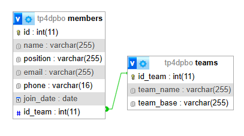
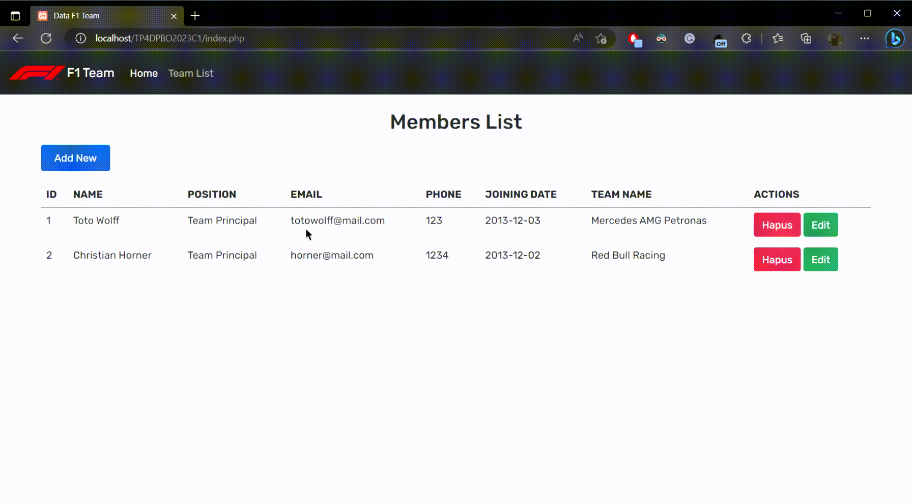

# TP4DPBO2023C1

## Janji
Saya Rifqi Fajar Indrayadi dengan NIM 2101103 mengerjakan Tugas Praktikum 4 DPBO dalam mata kuliah Desain Pemrograman Berorientasi Objek untuk keberkahan-Nya maka saya tidak melakukan kecurangan seperti yang telah dispesifikasikan. Aamiin.

## Desain Database

## Alur Program
1. Pada Halaman Utama terdapat list Member dengan data masing-masing member beserta nama team nya.
2. Untuk menambah member user dapat menekan tombol 'Add New' dan akan ditampilkan form untuk mengisi data member, untuk mengubah data bisa menekan tombol 'Edit' dan tombol 'Hapus' untuk menghapus data.
3. Untuk melihat list team bisa menekan tombol 'Team List' pada navbar dan akan ditampilkan list team, untuk action nya sama dengan di page awal.

## Dokumentasi Program

